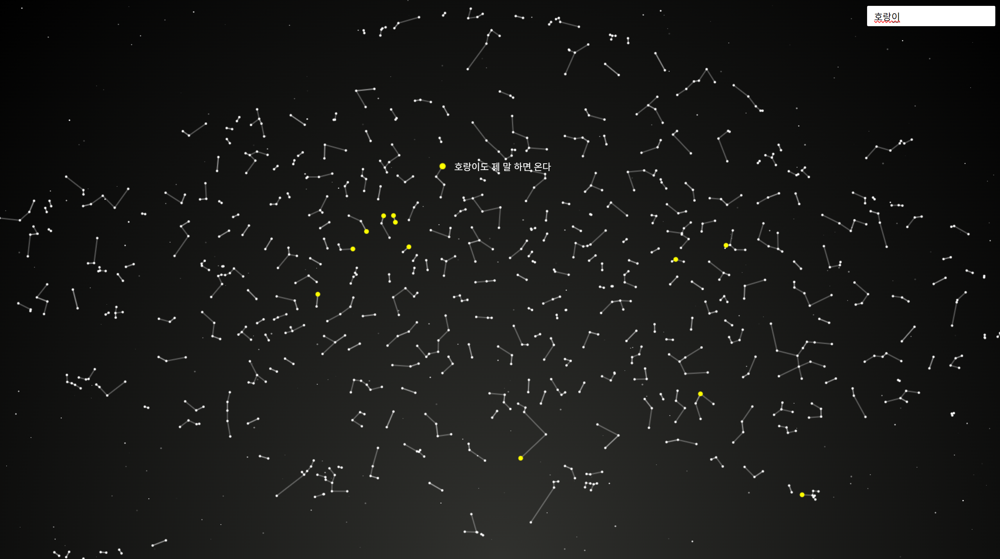

 

### 속담 갤럭시
##### embedding -> 2차원으로 축소 -> 가장 가까운 점 잇기 
model_name = "intfloat/multilingual-e5-large" 
coords = umap.UMAP(n_components=2, random_state=42).fit_transform(embeddings) 
 
🔗 [속담 갤럭시 바로가기](https://abc-crtl.github.io/sokdam/)

 
 

### 📸 Screenshots

  

